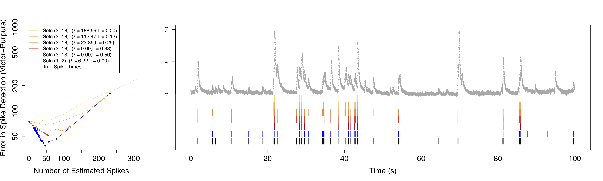

# Fast deconvolution of calcium imaging data via an $\ell_0$ penalty 

Overview
-----

This website provides software and tutorials to perform fast $\ell_0$ deconvolution of calcium imaging data, as described in 
these two papers  and , and as implemented in the 
Allen Brain Observatory platform paper .

Technical details
----

We assume that the observed fluorescence trace $y_{t}$ is a noisy version of the unobserved calcium concentration $c_{t}$. 
Furthermore, we assume that the calcium concentration decays exponentially, unless there is a spike, in which case 
the calcium concentration increases instantaneously. More precisely,
 
$$
\begin{align*}
y_t &= c_t + \epsilon_t, \quad \epsilon_t \sim_\text{ind.} (0, \sigma^2),  \quad t = 1, \ldots, T; \nonumber\\
c_t &= \gamma c_{t-1} + z_t, \quad t = 2,\ldots, T,
\end{align*}
$$

where $z_t\geq 0$, and where $z_{t} >0$ indicates the presence of a spike at the $t$th timestep. 

Based on this generative model, our earlier work  proposed solving the $\ell_0$ optimization problem 

$$
\underset{c_1,\ldots,c_T, z_2,\ldots,z_T}{\mathrm{minimize}}  
\frac{1}{2} \sum_{t=1}^T \left( y_t -  c_t \right)^2 + \lambda \sum_{t=2}^T 1_{\left( z_t \neq 0 \right) },
$$

where $\lambda>0$ is a tuning parameter that balances the tradeoff between the total number of spikes, $\sum_{t}z_t$, and 
the goodness-of-fit, $\frac{1}{2} \sum_{t=1}^T \left( y_t -  c_t \right)^2$.  

In , we develop a **very efficient** algorithm for solving  

$$
\underset{c_1,\ldots,c_T, z_2,\ldots,z_T}{\mathrm{minimize}}  
\frac{1}{2} \sum_{t=1}^T \left( y_t -  c_t \right)^2 + \lambda \sum_{t=2}^T 1_{\left( z_t \neq 0 \right) },
$$

as well as the related problem  

$$
\underset{c_1,\ldots,c_T, z_2,\ldots,z_T}{\mathrm{minimize}}  
\frac{1}{2} \sum_{t=1}^T \left( y_t -  c_t \right)^2 + \lambda \sum_{t=2}^T 1_{\left( z_t \neq 0 \right) }
\mbox{ subject to } z_t = c_t - \gamma c_{t-1} \geq 0,
$$

that ensures a spike results in an increase in the calcium concentration. This website introduces the efficient algorithm 
of our work . 

Allen Institute for Brain Science 
----

The Allen Brain Observatory platform paper  performs all spike deconvolution using the algorithm described on this website.

If you're working with the AIBS data, you may be interested to know that the AIBS also released an
update to their software development kit that provides users with the output from Algorithm 2 for close to 60,000 
neurons during different experimental conditions. See [https://allensdk.readthedocs.io/en/latest/](https://allensdk.readthedocs.io/en/latest/)
for additional information. 

Funding
----

This work was partially supported by the NIH BRAIN Initiative, R01EB026908, NIH grants DP5OD009145 and R01DA047869, 
NSF CAREER DMS-1252624, and a Simons Investigator Award in Mathematical Modeling of Living Systems to D. Witten. 
The following sources also provided support: 
the Natural Sciences and Engineering Research Council of Canada to S. Jewell, the Natural Sciences and 
Engineering Research Council of Canada grant RGPGR 448167-2013 
and Canadian Institutes of Health Research grants EP1-120608 and EP1-120609 to T. Hocking, 
and by the Engineering and Physical Sciences Research Council Grant EP/N031938/1 to P. Fearnhead.

References 
----


