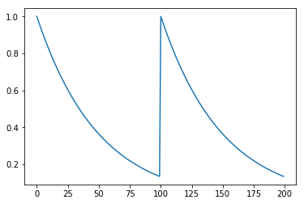

Python tutorial
----

In this tutorial, we demonstrate how the ```FastLZeroSpikeInference``` package can be used to deconvolve calcium imaging data from a single neuron. 
All demos require the ```FastLZeroSpikeInference``` package; installation instructions are provided [here](software.html). 

```python
from FastLZeroSpikeInference import fast
import numpy as np
%matplotlib inline
import numpy as np
import matplotlib.pyplot as plt
```


To illustratre the software, we use the following toy dataset.


```python
gam = 0.98
y = np.power(gam, np.concatenate([np.arange(100), np.arange(100)]))
plt.plot(y)
```





The ```estimate_spikes``` function estimates spikes based on the calcium trace, exponential decay parameter $\gamma$, and a tuning parameter $\lambda$. This function solves 

$$
\underset{c_1,\ldots,c_T, z_2,\ldots,z_T}{\mathrm{minimize}}  
\frac{1}{2} \sum_{t=1}^T \left( y_t -  c_t \right)^2 + \lambda \sum_{t=2}^T 1_{\left( z_t \neq 0 \right) } 
$$

if the ```constraint``` parameter is set to false (default), and 

$$
\underset{c_1,\ldots,c_T, z_2,\ldots,z_T}{\mathrm{minimize}}  
\frac{1}{2} \sum_{t=1}^T \left( y_t -  c_t \right)^2 + \lambda \sum_{t=2}^T 1_{\left( z_t \neq 0 \right) }
\mbox{ subject to } z_t = c_t - \gamma c_{t-1} \geq 0,
$$

if the ```constraint``` parameter is set to true. Here's an example of the function applied to the toy data. 


```python
fit = fast.estimate_spikes(y, gam, 1, False)
```

By default, and to save computation time, the calcium concentration is not automatically estimated. However, the ```estimate_calcium``` function can be used to estimate the calcium concentration based on a prior fit.


```python
# Determine calcium concentration from fit
fit = fast.estimate_calcium(fit)
plt.plot(fit['estimated_calcium'])
```


With estimated spike(s)


```python
fit['spikes'][0]
101
```


Alternatively, both spikes and calcium concentrations can be computed with the ```estimate_spikes``` function with ```estimate_calcium``` parameter set to true. 


```python
fit = fast.estimate_spikes(y, gam, 1, False, True)
```

To solve the constrained problem 

$$
\underset{c_1,\ldots,c_T, z_2,\ldots,z_T}{\mathrm{minimize}}  
\frac{1}{2} \sum_{t=1}^T \left( y_t -  c_t \right)^2 + \lambda \sum_{t=2}^T 1_{\left( z_t \neq 0 \right) }
\mbox{ subject to } z_t = c_t - \gamma c_{t-1} \geq 0,
$$

we set the ```constraint``` parameter to true in the ```estimate_spikes``` function. Consider the following example.


```python
fit = fast.estimate_spikes(y, gam, 1, True, True)
```
 


